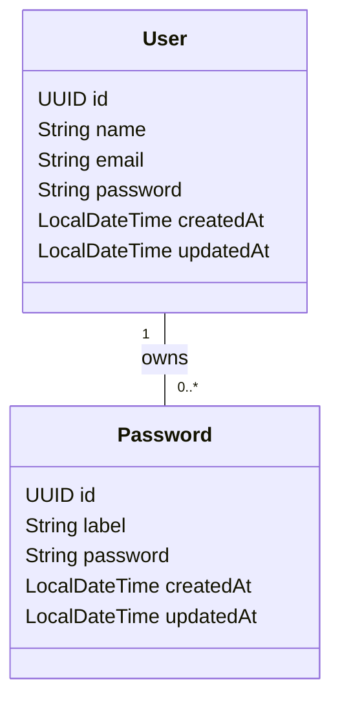

# Secure Pass

This application is a group of services that help users to generate, check, and store secure passwords. It's built with Java, Spring Boot, PostgreSQL, and Docker.

It's my implementation of the Password Generator and Password Checker challenges from the [Back-end Challenges](https://github.com/wesleybertipaglia/backend-challenges/) repository.

## Table of Contents

- [Features](#features)
- [Getting Started](#getting-started)
- [Entities](#entities)
- [Contributing](#contributing)
- [License](#license)

## Features

The application includes the following functionalities:

- Password Generator
- Password Checker
- Password Storage

## Getting Started

1. Prerequisites
- Java 17 or later
- Maven

2. Running with Maven
```bash
mvn spring-boot:run
```

3. Accessing the application
- API: [http://localhost:8080](http://localhost:8080)
- API Documentation (Swagger): [http://localhost:8080/swagger-ui/index.html](http://localhost:8080/swagger-ui/index.html)

## Entities

The following Entity-Relationship Diagram (ERD) shows the properties of the entities:



## Contributing
Contributions are welcome! Please fork the repository and submit a pull request with your changes.

## License
This project is licensed under the MIT License - see the [LICENSE](LICENSE) file for details.