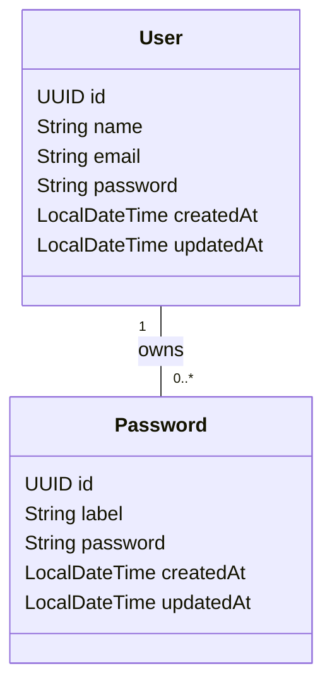

# Secure Pass

This application is a group of services that help users to generate, check, and store secure passwords. It's built with Java, Spring Boot, PostgreSQL, and Docker.

It's my implementation of the Password Generator and Password Checker challenges from the [Back-end Challenges](https://github.com/wesleybertipaglia/backend-challenges/) repository.

## Table of Contents

- [Features](#features)
- [Getting Started](#getting-started)
- [Entities](#entities)
- [Contributing](#contributing)
- [License](#license)

## Features

Secure Pass offers the following functionalities:

- **Password Generator**: Create strong, random passwords.
- **Password Checker**: Validate the strength and security of passwords.
- **Password Storage**: Safely store and manage passwords.

## Getting Started

### 1. Generating `app.key` and `app.pub`:

```bash
openssl genrsa -out src/main/resources/app.key 2048 
openssl rsa -in src/main/resources/app.key -pubout -out src/main/resources/app.pub
```

### 2. Create the `.env` File

- Create a `.env` file in the root directory using `.env.example` as a template.
- Edit the `.env` file to set the required environment variables.

### 3. Running the Application

#### Option 1: Using Docker

1. Ensure Docker and Docker Compose are installed.
2. Run the following command to start the application:

    ```bash
    docker-compose up
    ```

#### Option 2: Using Maven

1. Ensure Java 17 or latter, Maven, and PostgreSQL are installed.
2. Run the application with:

    ```bash
    mvn spring-boot:run
    ```

### 4. Accessing the Application

- **API Endpoint**: [http://localhost:8080](http://localhost:8080)
- **API Documentation (Swagger)**: [http://localhost:8080/swagger-ui/index.html](http://localhost:8080/swagger-ui/index.html)

## Entities

The following Entity-Relationship Diagram (ERD) shows the properties of the entities:



## Contributing
Contributions are welcome! Please fork the repository and submit a pull request with your changes.

## License
This project is licensed under the MIT License - see the [LICENSE](LICENSE) file for details.